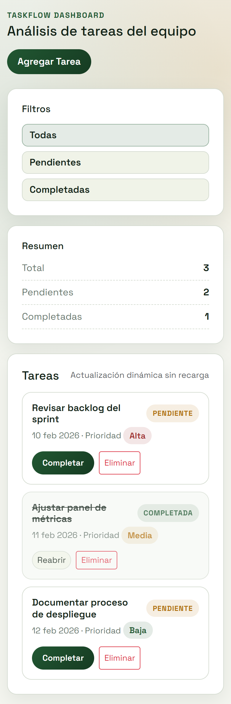

# TaskFlow Dashboard

Dashboard estatico para gestion de tareas de equipo usando HTML5 semantico, CSS Grid, Bootstrap personalizado, SASS modular y JavaScript ES6.

## Como ejecutar el proyecto
1. Instala dependencias:
```bash
npm install
```
2. Compila SASS:
```bash
npm run sass:build
```
3. Ejecuta la app:
- Opcion simple: abrir `index.html` en el navegador.
- Opcion recomendada: servir la carpeta con un servidor local (por ejemplo `npx serve .`) para emular un flujo real de desarrollo.

## Stack
- HTML5 + CSS Grid
- Bootstrap 5 (CDN)
- SASS (parciales)
- JavaScript ES6 (sin backend)
- Ruby (bonus para generar datos iniciales)

## Proceso de pensamiento y decisiones tecnicas
### Por que esta estructura de SASS
Use parciales para separar responsabilidades y mantener escalabilidad:
- `assets/scss/_variables.scss`: tokens de diseno (colores, spacing, breakpoints, sombras).
- `assets/scss/_mixins.scss`: reutilizacion de patrones (`focus-ring`, media queries).
- `assets/scss/_base.scss`: estilos globales y base visual.
- `assets/scss/_layout.scss`: distribucion estructural del dashboard.
- `assets/scss/_components.scss`: estilos de botones, tarjetas, filtros, estados de tarea y modal.
- `assets/scss/main.scss`: punto de entrada de compilacion.

Esto permite cambiar tema, layout o componentes sin mezclar estilos globales con estilos locales.

### Como resolvi el layout con Grid
El layout principal esta en `assets/scss/_layout.scss` con:
- `header` superior para branding y accion primaria.
- `dashboard-grid` con dos columnas en desktop:
  - sidebar fijo para filtros y resumen.
  - contenido flexible para lista de tareas.
- en pantallas pequenas, el grid pasa a una sola columna para mantener legibilidad y usabilidad movil.

## Funcionalidades implementadas
- Crear tareas desde modal sin recargar la pagina.
- Filtrar tareas por `Todas`, `Pendientes`, `Completadas`.
- Marcar tarea como `Completada` o `Pendiente`.
- Eliminar tareas.
- Resumen dinamico (total, pendientes, completadas).
- Bug responsive intencional corregido en la version final.

## Capturas de pantalla
### Escritorio


### Movil


## Bonus Ruby
Archivo incluido: `scripts/generate_tasks.rb`

Generar tareas de ejemplo:
```bash
ruby scripts/generate_tasks.rb --count 8 --out data/tasks.seed.json
```

Tambien puedes redirigir salida estandar:
```bash
ruby scripts/generate_tasks.rb > data/tasks.seed.json
```
